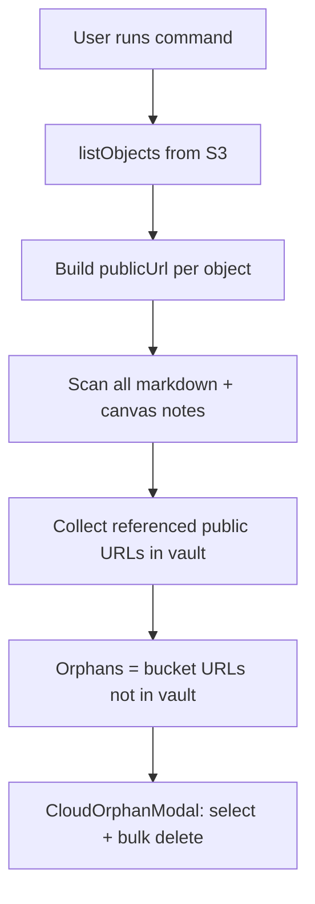
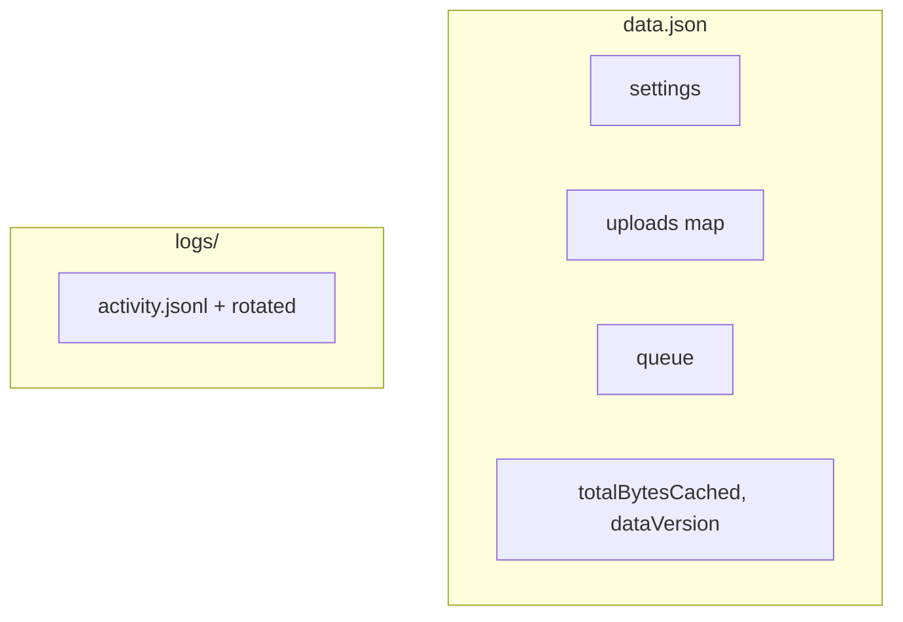

# Slim data.json + log files (no SQLite)

## Why SQLite is dropped

With reference tracking and dedup removed, the index is small enough for `data.json` again:

| Removed bloat | Savings |
|---|---|
| `logs` array | moved to `logs/*.jsonl` — **biggest win** (was rewritten on every log line) |
| `byContentHash`, `byLocalPath`, `noteRefs` | redundant maps gone |
| `contentHash`, `refCount`, `referencingNotes` per record | ~200 B/row saved |

Original pain was **logs + fat index in one blob**. Slim index + logs on disk fixes that without sql.js.

**Revisit SQLite** only if upload index exceeds ~50k entries and `saveData` latency becomes noticeable.

---

## Product scope

**Drop:**
- Reference counting, scheduled/debounced scans
- Content-hash dedup, find-duplicates UI
- **Sync from bucket** (index hydration from S3)

**Keep:** upload → S3 → rewrite links → index row; storage view; quota; offline queue.

**Add (on-demand only):**
- **Find orphaned items in cloud** — heavy command, user-triggered


---

## Commands

### Remove

| Command / file | ID |
|---|---|
| [`scan-references.ts`](src/commands/scan-references.ts) | `scan-references` |
| [`find-duplicates.ts`](src/commands/find-duplicates.ts) | `find-duplicates` |
| [`sync-from-bucket.ts`](src/commands/sync-from-bucket.ts) | `sync-from-bucket` |

Also remove **Sync from bucket** and **Review orphans** buttons from [`storage-view.ts`](src/ui/storage-view.ts).

Remove `syncFromBucket()` from [`storage-service.ts`](src/service/storage-service.ts).

### Add: Find orphaned items in cloud

New command ([`src/commands/find-cloud-orphans.ts`](src/commands/find-cloud-orphans.ts)):

- **ID:** `find-cloud-orphans`
- **Name:** `Find orphaned items in cloud`
- **Heavy / on-demand** — no scheduler, no auto-run on load

**Definition of cloud orphan:** a bucket object whose **public URL is not referenced** in any vault note (markdown + canvas). Not based on local index or `refCount`.



**Implementation** — [`src/service/cloud-orphan-service.ts`](src/service/cloud-orphan-service.ts):

1. `cloud.listObjects()` — full bucket listing (paginate if S3 repo supports it)
2. `vault.listMarkdownAndCanvas()` + read each note body
3. Build `Set<string>` of referenced URLs:
   - Match `publicBaseUrl` prefix URLs in content (markdown images, links, HTML embeds)
   - ponytail: substring search for `publicBaseUrl` + path segment / full `publicUrl` per object
4. Return `{ scannedNotes, bucketCount, orphans: CloudObjectSummary[] }`
5. Log progress to activity log (`info` start, `info` summary with counts)

**UX:**
- `Notice`: "Scanning bucket and vault…" at start
- Open [`CloudOrphanModal`](src/ui/cloud-orphan-modal.ts) with results
- Empty state: "No orphaned cloud objects found."

**Modal — select then delete** (not per-row instant delete):

| Control | Behavior |
|---|---|
| Header **Select all** checkbox | Toggle all row checkboxes |
| Row checkbox | Select individual orphan |
| **Delete selected** button | Enabled when ≥1 selected; confirm dialog then batch delete |
| Summary line | e.g. `12 orphans · 3 selected` |

**Delete flow:**
1. User checks rows (or select all)
2. Clicks **Delete selected**
3. Confirm modal: "Delete N object(s) from cloud? This cannot be undone."
4. `storage.deleteFromCloud(key)` per selected key (sequential or small concurrency)
5. Remove deleted rows from modal list; update summary; log count to activity log
6. Disable **Delete selected** when selection empty

Show cloud key + human-readable size per row. No delete until user explicitly selects and confirms.

**Optional:** link from storage view header — "Find cloud orphans" runs same scan → same modal.

---

## Storage split



### `data.json`

```typescript
interface PluginData {
  dataVersion: number;  // 2
  settings: CloudAttachmentSettings;
  uploads: Record<string, UploadRecord>;
  queue: QueueItem[];
  totalBytesCached: number;
}
```

**Settings removed:** `referenceTrackingEnabled`, `referenceScanSchedule`, `referenceUpdateDebounceMs`

### `logs/*.jsonl`

Append-only, rotate at 1000 lines, honor `logRetentionMax`, debounced flush.

---

## Slim `UploadRecord`

```typescript
export interface UploadRecord {
  cloudKey: string;
  publicUrl: string;
  size: number;
  uploadedAt: string;
  localPath?: string;
  linkStatus?: LinkStatus;
}
```

**`IUploadIndexRepo` — remove:** `findByContentHash`, `findByLocalPath`, `getDuplicateGroups`, `saveRefSyncBatch`, `getNoteRefs`, `updateLastReferenceScanAt`, `getData()`, log methods.

---

## Upload flow

[`upload-service.ts`](src/service/upload-service.ts): remove dedup block (lines 124–141). Always upload + rewrite links.

---

## Code to delete

| Path | Reason |
|---|---|
| `src/service/reference-service.ts` | Reference tracking |
| `src/utils/reference-extractor.ts` | Reference parsing |
| `src/commands/scan-references.ts` | Removed command |
| `src/commands/find-duplicates.ts` | Removed command |
| `src/commands/sync-from-bucket.ts` | Removed command |
| `src/utils/events/reference-debounce.ts` | Note-save hook |
| `src/utils/events/reference-scan-scheduler.ts` | Scheduler |
| `src/ui/duplicates-modal.ts` | Duplicates UI |
| `src/ui/orphan-review-modal.ts` | Replaced by cloud-orphan modal |
| `src/utils/content-hash.ts` | Dedup |
| `tests/unit/reference-service.test.ts` | Tests |
| `tests/unit/content-hash.test.ts` | Tests |

## Code to add

| Path | Responsibility |
|---|---|
| `src/service/cloud-orphan-service.ts` | Bucket list + vault URL scan |
| `src/commands/find-cloud-orphans.ts` | Command registration |
| `src/ui/cloud-orphan-modal.ts` | Results list, checkboxes, select all, bulk delete + confirm |
| `src/repository/log-file-repo.ts` | JSONL activity log |

**Edit:** [`commands/index.ts`](src/commands/index.ts), [`main.ts`](src/main.ts), [`app-context.ts`](src/app-context.ts), [`storage-view.ts`](src/ui/storage-view.ts) (drop Refs column, sync/orphan buttons), [`storage-service.ts`](src/service/storage-service.ts), [`settings-tab.ts`](src/ui/settings-tab.ts), [`types.ts`](src/types.ts), [`plugin-data-repo.ts`](src/repository/plugin-data-repo.ts), [`fake-repos.ts`](tests/helpers/fake-repos.ts).

---

## `plugin-data-repo.ts`

- Debounced `saveData` (500ms) for upload/queue changes
- Force flush on unload
- Migrate v1 → v2: move logs to JSONL, strip secondary indexes, slim upload rows

---

## Migration (on `load()`)

1. Move legacy `logs` → `logs/activity.jsonl`
2. Strip `byContentHash`, `byLocalPath`, `noteRefs`, `lastReferenceScanAt`
3. Slim upload records
4. `dataVersion: 2`, `saveData()`

---

## Scale

| Uploads | `data.json` | OK? |
|---|---|---|
| ~10k | ~2.5 MB | Yes |
| ~50k | ~12 MB | Borderline |

**Cloud orphan scan** cost scales with **bucket object count × note count** — intentionally heavy; run manually only. Large vaults may take minutes; log duration + counts.

---

## Manifest & docs

- `isDesktopOnly: false`
- Document: slim `data.json`, `logs/*.jsonl`, cloud orphan command (manual, heavy)
- `.gitignore`: `logs/`, `data.json`

No new npm dependencies.

---

## Tests

- `log-file-repo.test.ts` — append, rotate, retention
- `cloud-orphan-service.test.ts` — fake bucket + fake notes → correct orphan set
- Update `upload-service.test.ts` — no dedup path
- Remove reference/content-hash tests

---

## Out of scope

- SQLite
- Auto-scheduled orphan scans
- Sync-from-bucket / index hydration from S3
- Deduplication
- Paginated storage view
